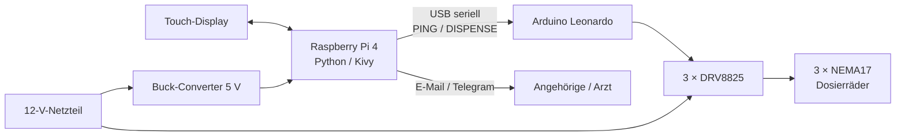

# SmartMediSpender

**Prototyp eines automatischen Medikamentenspenders für die Heimanwendung**
Diplomarbeit an der Höheren Fachschule für Medizintechnik Sarnen (HFMTS), 2026 – Samuel Weber

Der SmartMediSpender gibt Tabletten aus drei Silos zum geplanten Zeitpunkt aus, verlangt am Gerät eine Bestätigung der Einnahme und alarmiert Angehörige oder den Arzt per E-Mail oder Telegram, wenn die Bestätigung ausbleibt.

Dieses Repository enthält die Gerätesoftware für den Raspberry Pi (Python/Kivy) und die Firmware für den Arduino, der die Motoren ansteuert.

> [!WARNING]
> Der SmartMediSpender ist ein Ausbildungsprototyp und **kein zugelassenes Medizinprodukt**. Er ist nicht für den Einsatz mit echten Medikamenten oder echten Patientendaten vorgesehen.

---

## Funktionen

- **Benutzerverwaltung:** mehrere Profile mit optionalem Passwort und Patientendaten (Arzt, Kontaktpersonen)
- **Einnahmeplan:** Einträge pro Fach mit Uhrzeit, Anzahl (1–5 Tabletten) und Wiederholung (täglich, wöchentlich, einmalig), optional mit Enddatum
- **Automatische Ausgabe:** Die App prüft alle 10 Sekunden, ob ein Eintrag fällig ist, und schickt den Ausgabebefehl an den Arduino
- **Einnahmebestätigung:** Popup am Display, das die Einnahme bestätigen lässt
- **Alarmierung:** Nach Ablauf der Alarmfrist (Standard 30 Minuten) Alarm-Popup und Nachricht per E-Mail und/oder Telegram. Wird die Einnahme später doch bestätigt, geht eine zweite Nachricht raus
- **Ereignisprotokoll:** Ausgaben, Bestätigungen, Alarme und Fehler, 30 Tage rollierend, Export als Datei oder per E-Mail
- **Admin-PIN:** schützt Einstellungen sowie das Löschen und Zurücksetzen von Benutzern
- **Hardware-Test:** Probeausgabe pro Fach direkt aus den Einstellungen
- **Datensicherung:** Export und Wiederherstellung aller Daten
- **Autostart:** startet nach dem Einschalten automatisch und nach einem Absturz selbständig neu
- **Mock-Modus:** Entwicklung und Tests ohne angeschlossene Hardware

## Hardware

| Komponente | Verwendung |
|---|---|
| Raspberry Pi 4 | Oberfläche, Einnahmeplan, Protokoll, Alarmierung |
| Raspberry Pi Touch Display 2 (720 × 1280, Hochformat) | Bedienung am Gerät |
| Arduino Leonardo | Ansteuerung der Motoren |
| 3 × DRV8825 | Motortreiber, 1/32-Mikroschritt |
| 3 × NEMA17-Schrittmotor | Antrieb der Dosierräder, 90° pro Ausgabe |
| 12-V-Netzteil (120 W) + Buck-Converter 12 V → 5 V | gemeinsame Stromversorgung |
| Gehäuse, Silos, Dosierräder | eigene Konstruktion (SolidWorks), 3D-gedruckt aus ABS |



## Software-Architektur

Die Software ist in klar getrennte Schichten aufgebaut:

- **`ui/`** – Kivy-Screens, Popups und Widgets. Nur Darstellung und Bedienung.
- **`services/`** – die gesamte Geschäftslogik (Plan, Fälligkeit, Ausgabe, Alarmierung, Protokoll, Benutzer, Speicherung). Sie kennt Kivy nicht und lässt sich deshalb ohne Oberfläche testen.
- **`hardware/`** – serielle Verbindung zum Arduino, mit einem Mock-Transport gleicher Schnittstelle für die Entwicklung ohne Hardware.
- **`app.py`** – die App-Klasse `SmartMedGUI` als dünner Orchestrator: hält den Zustand und verbindet Timer und Touch-Events mit den Services.

Die Python-Seite kennt die mechanische Kalibrierung bewusst nicht. Sie sendet nur „Fach und Anzahl“, wie weit sich der Motor dafür dreht, legt allein die Firmware fest.

```
smartmed/
├─ firmware/arduino/smartmed_arduino/   # Arduino-Firmware (.ino)
├─ scripts/                             # Start-, Autostart- und Testskripte
├─ src/smartmed/
│  ├─ app.py              # App-Klasse SmartMedGUI + create_app()
│  ├─ main.py             # Einstiegspunkt (python -m smartmed.main)
│  ├─ config.py           # Konfiguration, Display- und Kiosk-Einstellungen
│  ├─ hardware/           # serielle Kommunikation, Protokoll, Mock
│  ├─ models/             # Standardwerte der Datenstruktur
│  ├─ services/           # Geschäftslogik
│  └─ ui/                 # Screens, Popups, Theme, Widgets
├─ tests/                 # Unittests der Services
├─ data/                  # Laufzeitdaten (wird automatisch angelegt)
├─ exports/               # Log-Exporte und Backups
├─ .env.example
└─ pyproject.toml
```

Umfang: rund 6000 Zeilen Python in 50 Dateien, rund 2000 Zeilen Tests in 18 Testdateien und 182 Zeilen Arduino-Firmware.

## Serielles Protokoll (Raspberry Pi ↔ Arduino)

Textbasierte Befehle über USB, 115200 Baud, jede Zeile endet mit `\n`.

| Befehl | Antwort bei Erfolg | Bedeutung |
|---|---|---|
| `PING` | `OK PONG` | Verbindung prüfen |
| `DISPENSE <Fach> <Anzahl>` | `OK DISPENSE <Fach> <Anzahl>` | Fach 1–3 gibt die angegebene Anzahl aus |

Im Fehlerfall antwortet der Arduino mit `ERR <Code>`: `UNKNOWN_COMMAND`, `INVALID_FORMAT`, `INVALID_SLOT`, `INVALID_COUNT`, `SLOT_NOT_ENABLED` oder `DISPENSE_FAILED`.

Eine Ausgabeeinheit entspricht 1600 Mikroschritten, also 90° bei 1/32-Mikroschritt. Die Kalibrierung pro Fach steht in `STEPS_PER_DISPENSE_UNIT` in der Firmware.

## Installation auf dem Raspberry Pi

Voraussetzung: Raspberry Pi mit Raspberry Pi OS (Desktop), Python 3.13.

```bash
git clone https://github.com/KylarS7ern/smartmed.git
cd smartmed
python3 -m venv .venv
source .venv/bin/activate
pip install -e .
cp .env.example .env      # Zugangsdaten für E-Mail/Telegram eintragen
./scripts/run_pi.sh
```

Der Projektordner kann beliebig heissen und liegen, alle Skripte ermitteln ihren Pfad selbst.

### Arduino-Firmware aufspielen

1. `firmware/arduino/smartmed_arduino/smartmed_arduino.ino` in der Arduino IDE öffnen
2. Board **Arduino Leonardo** wählen und hochladen
3. Verbindung testen:

   ```bash
   PYTHONPATH=src python scripts/test_arduino_serial.py
   ```

   Das Skript sendet `PING` und löst eine Probeausgabe an Fach 1 aus.

### Autostart einrichten

```bash
./scripts/install_autostart.sh
```

Das legt einen Autostart-Eintrag unter `~/.config/autostart/` an. Nach dem nächsten Login startet die App über `scripts/run_pi_resilient.sh`. Dieses Skript wartet kurz, bis der Arduino am USB erkannt ist, und startet die App nach einem Absturz neu. Das Protokoll dazu liegt in `logs/autostart.log`.

Deaktivieren:

```bash
rm ~/.config/autostart/smartmed-autostart.desktop
```

## Konfiguration (`.env`)

Zugangsdaten und Geräteeinstellungen stehen in der Datei `.env`, die nicht ins Repository gehört (steht in `.gitignore`). Vorlage: `.env.example`.

| Variable | Standard | Bedeutung |
|---|---|---|
| `SMARTMED_TELEGRAM_BOT_TOKEN` | – | Token des Telegram-Bots |
| `SMARTMED_EMAIL_SMTP_SERVER` | `smtp.gmail.com` | SMTP-Server für E-Mail-Alarme |
| `SMARTMED_EMAIL_SMTP_PORT` | `587` | SMTP-Port |
| `SMARTMED_EMAIL_USERNAME` | – | Absenderadresse |
| `SMARTMED_EMAIL_PASSWORT` | – | Passwort (bei Gmail ein App-Passwort) |
| `SMARTMED_ARDUINO_PORT` | `/dev/ttyACM0` | serieller Port des Arduino |
| `SMARTMED_ARDUINO_BAUDRATE` | `115200` | Baudrate |
| `SMARTMED_ARDUINO_TIMEOUT` | `2.0` | Timeout in Sekunden für `PING` |
| `SMARTMED_ARDUINO_DISPENSE_TIMEOUT_PER_UNIT` | `8.0` | Wartezeit pro Ausgabeeinheit in Sekunden |
| `SMARTMED_HARDWARE_MODE` | `real` | `real` = Arduino, `mock` = simuliert |
| `SMARTMED_KIOSK` | `1` | `1` = Vollbild am Gerät, `0` = normales Fenster |

Die Empfänger der Alarme (E-Mail-Adresse, Telegram-Chat-ID) und die Alarmfrist werden direkt in der App unter den Alarm-Einstellungen festgelegt.

## Entwicklung ohne Hardware (Windows / VS Code)

Die App läuft auch auf einem normalen Laptop, ohne Raspberry Pi und Arduino.

```powershell
python -m venv .venv
.venv\Scripts\Activate.ps1
pip install -e .
copy .env.example .env
```

In der `.env` setzen:

```
SMARTMED_HARDWARE_MODE=mock
SMARTMED_KIOSK=0
```

Starten:

```powershell
$env:PYTHONPATH = "src"
python -m smartmed.main
```

In VS Code geht es auch über **Run and Debug** → „SmartMed: App starten (lokal)“.

## Tests

```bash
python -m unittest discover -s tests
```

Die Unittests prüfen die Services unabhängig von Oberfläche und Hardware, unter anderem Plan- und Fälligkeitslogik, Ausgabe, Alarmierung, Protokoll, Benutzerkonten und Datensicherung. In VS Code sind sie im Test-Explorer verfügbar.

Ergebnisse der Tests am fertigen Prototyp:

| Test | Ergebnis |
|---|---|
| Dosiertest (3 × 50 Ausgaben) | 146 von 150 korrekt (97.3 %) |
| Zeitgenauigkeit (10 Ausgaben) | Abweichung 10 s, Toleranz ±1 min |
| Bestätigung und Alarmierung | 22 von 22 Durchläufen wie erwartet |
| Fehlerfälle (Arduino getrennt, Absturz, Stromausfall, kein Internet) | 4 von 4 wie erwartet |

## Datenablage

| Pfad | Inhalt |
|---|---|
| `data/smartmed_plan.json` | alle Laufzeitdaten: Benutzer, Pläne, Einstellungen, Protokoll |
| `exports/` | Log-Exporte und Backups (`smartmed_backup_JJJJ-MM-TT_HH-MM-SS.json`) |
| `logs/autostart.log` | Protokoll des Autostart-Skripts |

Die Daten liegen lokal und unverschlüsselt auf dem Gerät. `data/` und `exports/` sind vom Repository ausgeschlossen.

## Admin-PIN zurücksetzen

Es gibt bewusst keinen „PIN vergessen“-Knopf in der App, weil er den Schutz aushebeln würde. Ein Reset geht nur mit direktem Zugriff auf den Raspberry Pi:

1. App beenden
2. `data/smartmed_plan.json` öffnen, z. B. mit `nano`
3. Den Eintrag auf `"admin_pin": "",` setzen und speichern
4. App neu starten und unter „Erweiterte Einstellungen“ einen neuen PIN setzen

## Bekannte Einschränkungen

- Es gibt keinen Sensor zur Kontrolle der Ausgabe. Leere oder doppelte Ausgaben und leere Silos werden nicht erkannt.
- Eine Einnahme, die während eines Stromausfalls fällig wird, wird nach dem Neustart nicht nachgeholt und löst keinen Alarm aus.
- Ist der Arduino getrennt, erscheint eine Fehlermeldung am Display, aber keine Nachricht an die Angehörigen.
- Kein akustisches Signal.
- Die Alarmfrist hat keine Obergrenze.
- Alle drei Fächer verwenden denselben Kalibrierwert.

## Mögliche Weiterentwicklungen

- Lichtschranke im Trichter zur Zählung der Ausgaben, mit erneutem Versuch bei Fehlausgabe
- Erkennung verpasster Einnahmen nach einem Neustart
- Alarm auch bei Hardwarefehlern
- Akustisches Signal zur Einnahmezeit
- Silos und Dosierräder, die sich ohne Werkzeug entnehmen und reinigen lassen

## Projektkontext

Die Software ist Teil der Diplomarbeit *„SmartMediSpender: Automatische Medikamentenausgabe“* zum dipl. Medizintechniker HF. Mechanik, Elektronik, Tests und Ergebnisse sind in der schriftlichen Arbeit vollständig dokumentiert.

Bei der Entwicklung wurden ChatGPT (OpenAI) und Claude (Anthropic) als Hilfsmittel eingesetzt. Der Code wurde vom Autor geprüft, angepasst und am Gerät getestet.
